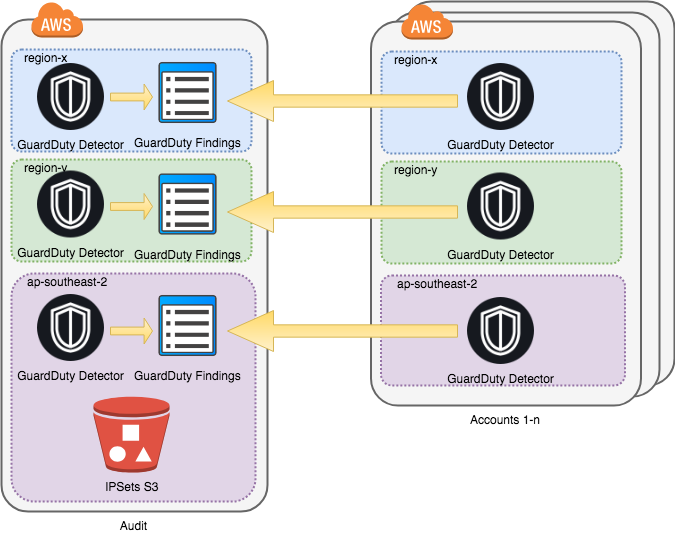

<!-- vim: set ft=markdown: -->

# terraform-aws-guardduty

#### Table of contents

1. [Overview](#overview)
2. [AWS GuardDuty - Overview Diagram](#aws-guardduty---overview-diagram)
3. [AWS GuardDuty Terraform](#aws-guardduty-terraform)
    * [Resources docs](#resources-docs)
    * [Inputs](#inputs)
    * [Outputs](#outputs)
4. [License](#license)

## Overview

Amazon GuardDuty is a continuous security monitoring service that analyses and processes the following data sources: VPC Flow Logs, AWS CloudTrail event logs, and DNS logs. It uses threat intelligence feeds, such as lists of malicious IPs and domains, and machine learning to identify unexpected and potentially unauthorised and malicious activity within your AWS environment.

This repo contains Terraform modules for configuring AWS GuardDuty and managing IPSets and ThreadSets used by GuardDuty.

Terraform >= 0.12.20 is required for this module.

## AWS GuardDuty - Overview Diagram

## AWS GuardDuty Terraform

### Resources docs

AWS GuardDuty automation includes use of the following core Terraform resources:

- [`aws_guardduty_detector`](https://www.terraform.io/docs/providers/aws/r/guardduty_detector.html) - A resource to manage a GuardDuty detector.
- [`aws_guardduty_invite_accepter`](https://www.terraform.io/docs/providers/aws/r/guardduty_invite_accepter.html) - A resource to accept a pending GuardDuty invite on creation, ensure the detector has the correct master account on read, and disassociate with the master account upon removal.
- [`aws_guardduty_ipset`](https://www.terraform.io/docs/providers/aws/r/guardduty_ipset.html) - IPSet is a list of trusted IP addresses.
- [`aws_guardduty_member`](https://www.terraform.io/docs/providers/aws/r/guardduty_member.html) - A resource to manage a GuardDuty member.
- [`aws_guardduty_threatintelset`](https://www.terraform.io/docs/providers/aws/r/guardduty_threatintelset.html) - ThreatIntelSet is a list of known malicious IP addresses.

### Inputs

The below outlines the current parameters and defaults.

| Name | Description | Type | Default | Required |
|------|-------------|:----:|:-------:|:--------:|
|bucket_name|Name of the S3 bucket to use|string|""|Yes|
|is_guardduty_master|Whether the account is a master account|bool|false|No|
|is_guardduty_member|Whether the account is a member account|bool|false|No|
|force_destroy|(Optional) A boolean that indicates all objects should be deleted from the bucket so that the bucket can be destroyed without error. These objects are not recoverable.|bool|false|No|
|detector_enable|Enable monitoring and feedback reporting|bool|true|No|
|ipset_format|The format of the file that contains the IPSet|string|TXT|No|
|ipset_iplist|IPSet list of trusted IP addresses|list|[]|No|
|threatintelset_format|The format of the file that contains the ThreatIntelSet|string|TXT|No|
|threatintelset_iplist|ThreatIntelSet list of known malicious IP addresses|list|[]|No|
|master_account_id|Account ID for Guard Duty Master. Required if is_guardduty_member|string|""|Yes|
|member_list|The list of member accounts to be added. Each member list need to have values of account_id, member_email and invite boolean|object|[]|No|

### Outputs

|Name|Description|
|------------|---------------------|
|detector_id|The ID of the GuardDuty detector|
|account_id|The AWS account ID of the GuardDuty detector|

## License

Apache 2.0.
